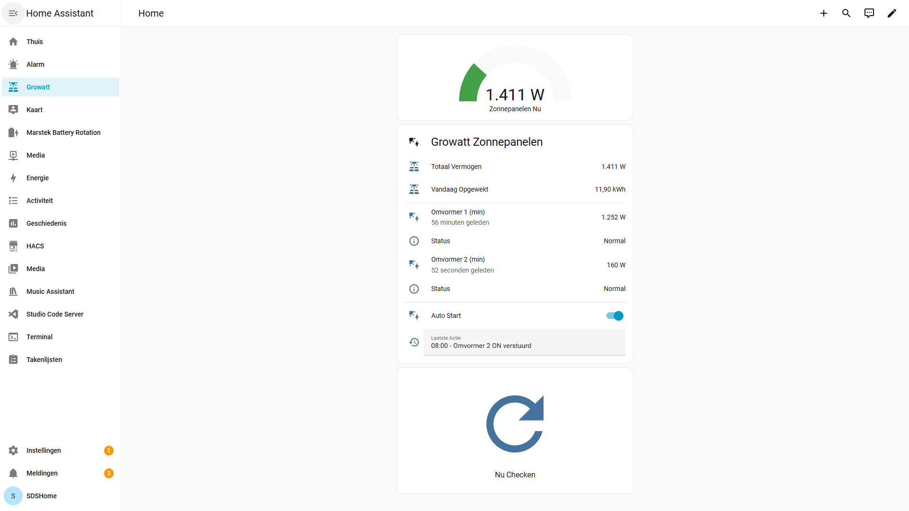

# Growatt Control App

A Flutter Android app for monitoring and controlling Growatt solar inverters remotely.

## Features

- **Real-time Monitoring**: View current power output, daily/total energy production, and inverter status
- **Remote Control**: Turn inverters on/off remotely
- **Multi-Device Support**: Manage multiple inverters from a single app
- **Live Updates**: Automatic refresh with countdown timers
- **Status Indicators**:
  - 🟢 Green: Inverter producing power (Normal)
  - 🟠 Orange: Inverter waiting for sunlight (Waiting)
  - 🔴 Red: Inverter offline or fault
- **Aggregate Stats**: View total power across all devices
- **Rate Limit Protection**: Built-in cooldown timers to respect API limits
- **Secure**: API token stored locally on device

## Screenshots



## Prerequisites

- Android device (Android 5.0+)
- Growatt OSS account with API access
- One or more Growatt inverters registered to your account

## Installation

### Option 1: Download APK (Recommended)
1. Download `app-release.apk` from the releases page
2. Transfer to your Android device
3. Open the APK file on your device
4. Allow installation from unknown sources if prompted
5. Install the app

### Option 2: Build from Source
```bash
# Clone the repository
git clone https://github.com/YOUR_USERNAME/growatt_control_app.git
cd growatt_control_app

# Install dependencies
flutter pub get

# Build APK
flutter build apk --release

# APK location: build/app/outputs/flutter-apk/app-release.apk
```

## Configuration

### 1. Get Your API Token

1. Go to [Growatt OSS Portal](https://oss.growatt.com)
2. Log in or create an account
3. Navigate to API settings
4. Generate a new API token (32-character code)
5. Save this token - you'll need it in the app

### 2. Configure the App

1. Open the Growatt Control App
2. Tap the settings icon (⚙️) in the top right
3. Enter your API token
4. Select your region:
   - **International**: Europe, most of the world
   - **China**: China mainland
   - **North America**: USA, Canada
   - **Australia/NZ**: Australia, New Zealand
5. Tap "Save Settings"
6. The app will automatically load your devices

## Usage

### Monitoring Inverters

- **Status Badge**: Shows current state (Waiting/Normal/Fault)
- **Current Power**: Real-time power output in Watts
- **Today's Energy**: kWh produced today
- **Temperature**: Inverter temperature (if available)
- **Last Updated**: Time since last data refresh

### Controlling Inverters

1. Locate the Power Control switch on a device card
2. Toggle the switch to turn the inverter on/off
3. Wait for confirmation (green/red snackbar)
4. Note: There's a 5-second cooldown between toggle operations

### Refreshing Data

- **Pull to refresh**: Drag down on the device list
- **Floating button**: Tap the refresh button (bottom right)
- **Auto-refresh**: Data older than 5 minutes is automatically refreshed
- Note: There's a 5-second cooldown between manual refreshes

## Technology Stack

- **Framework**: Flutter 3.x
- **Language**: Dart
- **State Management**: Provider
- **HTTP Client**: http package
- **Platform**: Android (iOS support possible)
- **API**: Growatt OpenAPI v4

## API Rate Limits

The app automatically enforces these limits:

- **Device List**: Max once every 5 seconds
- **Device Control** (on/off): Max once every 5 seconds
- **Device Data**: Cached for 5 minutes per device

## Known Limitations

- Noah-type devices do not support power control (API limitation)
- Device data is cached for 5 minutes to respect API rate limits
- No support for changing advanced inverter parameters
- Cannot view historical data graphs (may be added in future)

## Troubleshooting

### "No Configuration Found"
- Ensure you've entered a valid API token in Settings
- Check that you selected the correct region

### "Failed to load devices"
- Verify your internet connection
- Check that your OSS account has devices registered
- Ensure your API token hasn't expired

### "Device shows Unknown status"
- Try manually refreshing (wait 5+ minutes if recently refreshed)
- Restart the app
- Check if device is online in Growatt web portal

### Switch is disabled
- Device may be in Fault state
- Wait for cooldown timer to expire

## Development

See [docs/DEVELOPMENT.md](docs/DEVELOPMENT.md) for:
- Project architecture
- Development setup
- Building from source
- Contributing guidelines

## API Reference

See [docs/API_REFERENCE.md](docs/API_REFERENCE.md) for:
- API endpoints
- Request/response formats
- Error codes
- Example curl commands

## Changelog

See [docs/CHANGELOG.md](docs/CHANGELOG.md) for version history.

## License

This project is licensed under the MIT License - see the LICENSE file for details.

## Acknowledgments

- Growatt for providing the OpenAPI
- Flutter team for the excellent framework
- All contributors and testers

## Support

For issues, questions, or feature requests, please open an issue on GitHub.

## Disclaimer

This is an unofficial app and is not affiliated with, endorsed by, or supported by Growatt. Use at your own risk. Always verify critical operations in the official Growatt app or web portal.
